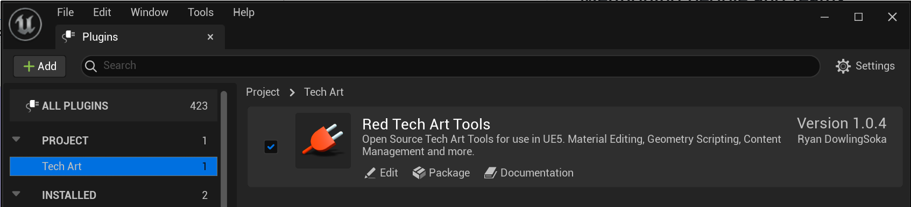

# RedTechArtTools

Unreal Engine 5 Plugin for a variety of Tech Art Tools and features.

Compatible with Unreal Engine verion 5.2.1+ (See other branches for other engine versions. Not all features will be supported on all versions.)

## Installation

Download the zip (or clone this repository) to your project or engine plugin folder.

Remember, if you are using the UE5 launcher, you must put the plugin in the project folder to have it be compiled correctly.

The plugin is not **EnabledByDefault** so you will need to enable it in your project settings through the plugin window.

## Current Tools

### [Material Parameters Helper Widget v1.0.5](https://github.com/Ryan-DowlingSoka/RedTechArtTools/wiki/Material-Parameter-Helper)

Helps with the management, naming, default data, and editing of all material parameters inside of a single material, even if the material parameters are spread through many different material functions.

### [Editor Icon Widget](https://github.com/Ryan-DowlingSoka/RedTechArtTools/wiki/Editor-Icon-Widget)

Provides access to all unreal native editor icons in a convenient widget.

### BP Enum

Hacky class for when things have gotten out of hand. If you have blueprint defined enums in your project and refactoring them is not a reasonable option, this tool (FRedBPEnum) can let you use and manipulate these enums without having to convert them into code, in a slightly better way than the other bad alternatives.

### Barycentric Coordinate Geometry Script

Small editor utility to add barycentric uvs to set meshes using geometry scripting. Can be useful for creating a wireframe shader on assets and a variety of other effects. Also a good starting point for looking at how geometry scripting can work.

[Blog post on how to make this for yourself and more information on what is going on.](https://ryandowlingsoka.com/unreal/wireframe-barycentric-coords/)

### Batch Rename Widget

Editor utility to add batch renaming of actors and assets through a right click menu.

[Tutorial series on how you can make your own batch rename widget and how it works.](https://ryandowlingsoka.com/unreal/batch-rename-tool/)
