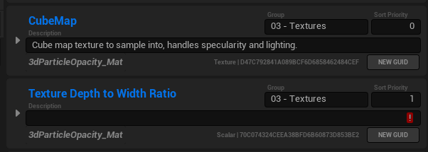

# RedTechArtTools

Unreal Engine 5 Plugin for a variety of Tech Art Tools and features.

Compatible with Unreal Engine verion 5.0.1+

## Installation

Download the zip (or clone this repository) to your project or engine plugin folder.

Remember, if you are using the UE5 launcher, you must put the plugin in the project folder to have it be compiled correctly.

The plugin is not **EnabledByDefault** so you will need to enable it in your project settings through the plugin window.

## Current Tools

### Material Parameters Helper Widget v1.0.5

[Overview Video](Documentation/mph.full-video.mp4)

Production tested materials often have many parameters, and for good reason these parameters are often scattered through modular Material Functions. Naming, Sorting, adding descriptions, and editing defaults for these parameters can be a big pain when working with lots of parameters in various functions and material graphs.

In addition, it can be really difficult to find where a parameter is used when materials are made through modular Material Functions, since the search feature only can search the local graph.

The Material Parameters Helper Widget attempts to make all of these issues go away by providing a singular interface to modify all parameters used in a material, whether they are at the base material graph level, or inside of a function.

#### Opening the widget.

The widget is opened through a scripted asset action.
Right-click any **Material** or **Material Instance** in the content browser, go to **Scripted Asset Actions** > **Open Material Parameter Helper Widget**.

If you need to check another material, you can change the **Material To Edit** property to the new material you want to edit.

#### Function List

The bottom left field lists all the functions that are used in the material. These functions are expandable, showing all the parameter names used in that function.

Clicking a parameter name in the functions list will take you to the corresponding parameter in the total list of parameters on the right.

Functions can be 'disabled' which will hide their results in the right panel, useful when you only need to work on a few parameters at a time.

Clicking the Function name will locate that function in the content browser.

#### Parameters List

The right panel is the parameters list. All parameters used in the enabled functions show up here sorted by **Group Name** > **Sort Priority** > **Parameter Name**, the same sorting used in the Material Instance editor. At the top is a filter search bar which compares against the group name and the parameter name of each item.

Here each parameter's Name, Description, Sort Priority, and Group Name can be edited directly. Modifying Name, Sort Priority, or GroupName will resort the parameter into the list.

Description is a multi-line text box, shift+enter to add a new line. Enter commits the current values.

Parameters can be expanded by clicking on the expansion arrow on the left side to see all the properties of the parameter expression.

Default values, channel mask names, and anything that could be edited in the material graph can be edited here.

> :warning: Changing **Sort Priority**, **Group Name**, or **Parameter Name** through the expansion panel will not refresh the panel's sorting.
>
> The parameter will still be sorted properly in the material instance, but the changes won't be reflected until after the widget is refreshed. You can refresh the widget by reassigning the **Material to Edit**

Clicking the **Material Function** name below the Description field will open the function or material and focus the node directly.

To save changes and update any open material instance editors click the Save and Apply Button.

### Batch Rename Widget

todo