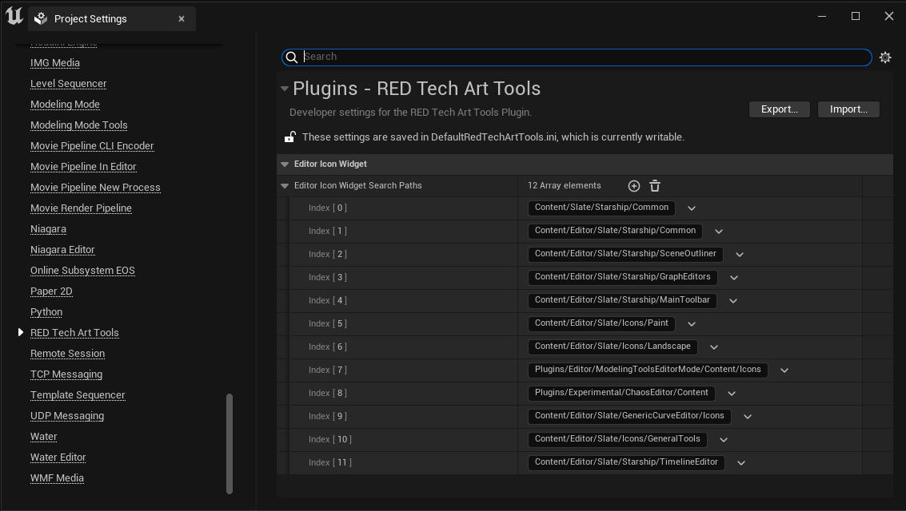

# RedTechArtTools

Unreal Engine 5 Plugin for a variety of Tech Art Tools and features.

Compatible with Unreal Engine verion 5.0.1+

## Installation

Download the zip (or clone this repository) to your project or engine plugin folder.

Remember, if you are using the UE5 launcher, you must put the plugin in the project folder to have it be compiled correctly.

The plugin is not **EnabledByDefault** so you will need to enable it in your project settings through the plugin window.

## Current Tools

### Material Parameters Helper Widget v1.0.5

### Editor Icon Widget

When making Editor Utility Widgets and tools, it is a pain to create your own icons for simple stuff the engine already has. This tool solves that. It is simily a widget that shows a list of all available slate brushes from select folders and provides them for use exactly as UImage.

The lists of folders is configurable, so if you like working with SVGs you can also add your own folders to the list, and they will be populated. Paths are relative to the /Engine folder. Project paths are untested but probably are accessible by using ../ at the start to get out of the Engine folder.

The widget is editor only, use in a runtime widget will fail to cook.

### Batch Rename Widget

todo
